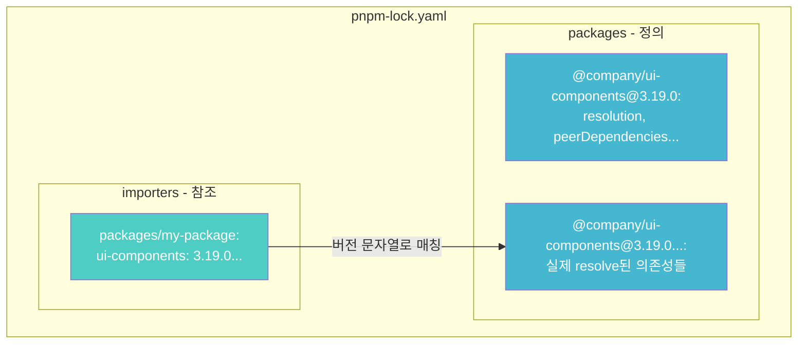
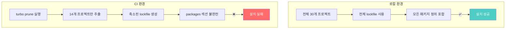
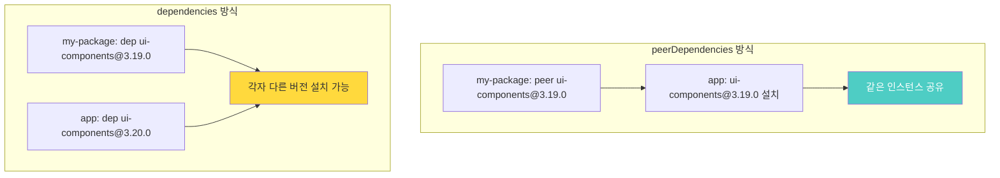

## 문제 상황

PR을 올렸는데 CI에서 다음과 같은 에러가 발생했습니다.

```
ERR_PNPM_LOCKFILE_MISSING_DEPENDENCY  Broken lockfile: no entry for
'@company/ui-components@3.19.0(@types/react@18.2.68)(tailwindcss@3.4.19)...'
```

로컬에서 `pnpm install` 을 실행하면 문제없이 동작합니다. lockfile도 변경되지 않습니다.

---

## 원인 파악: 로컬 vs CI의 차이

에러 메시지를 자세히 살펴보니 단서가 있었습니다.

```
Scope: all 14 workspace projects  ← CI
Scope: all 30 workspace projects  ← 로컬
```

CI에서는 **일부 프로젝트만** 빌드하고 있었습니다.

### Docker 빌드 과정

CI의 Docker 빌드 과정은 다음과 같습니다.


turbo prune이 문제의 원인일 수 있다고 판단했습니다.

---

## 검증: turbo prune 동작 확인

로컬에서 직접 turbo prune을 실행해봤습니다.

```bash
turbo prune --scope=@company/my-package --docker
```

생성된 lockfile을 확인한 결과:

```bash
# 원본 lockfile
grep "@company/ui-components@3.19.0" pnpm-lock.yaml
# 결과: 2개 항목 존재 ✅

# pruned lockfile
grep "@company/ui-components@3.19.0" out/pnpm-lock.yaml
# 결과: 참조만 있고 정의가 없음 ❌
```

turbo prune이 lockfile을 불완전하게 생성하고 있었습니다.

---

## 배경 지식: pnpm lockfile의 구조

문제를 이해하려면 pnpm lockfile v9의 구조를 알아야 합니다.



- **importers**: 각 패키지가 어떤 의존성을 사용하는지 (참조)
- **packages**: 실제 패키지 정의와 resolve된 peer dependency 조합

pnpm은 importers의 버전 문자열을 키로 사용해서 packages에서 실제 패키지를 찾습니다.

---

## 문제의 핵심: peerDependencies 처리 버그

패키지의 package.json이 다음과 같이 선언되어 있었습니다.

```json
{
  "peerDependencies": {
    "@company/ui-components": "3.19.0"
  }
}
```

그리고 pnpm 설정에는:

```yaml
# pnpm-lock.yaml
settings:
  autoInstallPeers: true  # peer dependency 자동 설치
```

### 로컬에서는 왜 동작했을까?



**turbo prune의 버그**: peerDependencies에만 선언된 패키지를 pruned lockfile의 packages 섹션에 포함시키지 않습니다.

### 불완전한 lockfile의 모습

```yaml
# out/pnpm-lock.yaml (pruned)

importers:
  packages/my-package:
    dependencies:
      '@company/ui-components':
        specifier: 3.19.0
        version: 3.19.0(@types/react@18.2.68)(tailwindcss@3.4.19)...
        #        ↑ 이 키로 packages에서 찾으려 하지만...

packages:
  # 🕳️ 텅 비어있음
  # '@company/ui-components@3.19.0': 없음
  # '@company/ui-components@3.19.0(...)': 없음
```

참조는 있는데 정의가 없으니 pnpm이 "lockfile이 깨졌다"고 판단한 것입니다.

---

## 해결 방법

### 방법 1: dependencies로 이동 (권장)

```diff
{
  "peerDependencies": {
-   "@company/ui-components": "3.19.0"
  },
  "dependencies": {
+   "@company/ui-components": "3.19.0"
  }
}
```

dependencies에 명시적으로 선언하면 turbo prune이 lockfile에 포함시킵니다.

### 방법 2: CI에서 frozen-lockfile 비활성화

```dockerfile
# 기존
RUN pnpm install --frozen-lockfile

# 변경
RUN pnpm install --no-frozen-lockfile
```

lockfile을 재생성하도록 허용합니다. 단, 빌드 재현성이 떨어질 수 있습니다.

### 방법 3: turbo 버전 업그레이드

최신 버전에서 수정되었을 수 있습니다. (이 케이스에서는 해결되지 않았습니다)

---

## 추가 고려사항: peerDependencies vs dependencies

해결 후 한 가지 고려할 점이 있습니다.



React 컴포넌트 라이브러리는 보통 Context를 통해 상태를 공유합니다. 버전이 다르면 Context가 분리되어 예상치 못한 버그가 발생할 수 있습니다.

**결론**: dependencies로 옮기더라도 상위 앱에서 같은 버전을 사용하도록 주의가 필요합니다.

---

## 정리

1. **로컬과 CI 환경 차이 확인**
   - CI에서 prune/subset 빌드를 사용한다면 lockfile 호환성 문제가 발생할 수 있습니다
2. **lockfile 구조 이해**
   - pnpm v9의 peer dependency 해결 방식과 turbo prune의 호환성 문제가 있습니다
3. **peerDependencies vs dependencies 트레이드오프**
   - peer: 버전 일치 강제, 인스턴스 공유
   - deps: 독립적이지만 중복 설치 가능성
4. **에러 메시지의 힌트 활용**
   - "14 workspace projects" vs "30 workspace projects" 차이가 문제 해결의 실마리였습니다

---

## 참고 자료

- https://pnpm.io/ko/git#lockfile
- https://turbo.build/repo/docs/reference/prune
- https://nodejs.org/en/blog/npm/peer-dependencies

---

모노레포를 운영하면서 비슷한 문제를 겪는 분들에게 도움이 되길 바랍니다.
